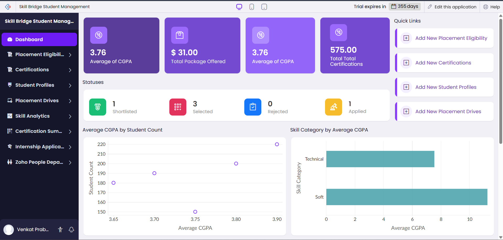
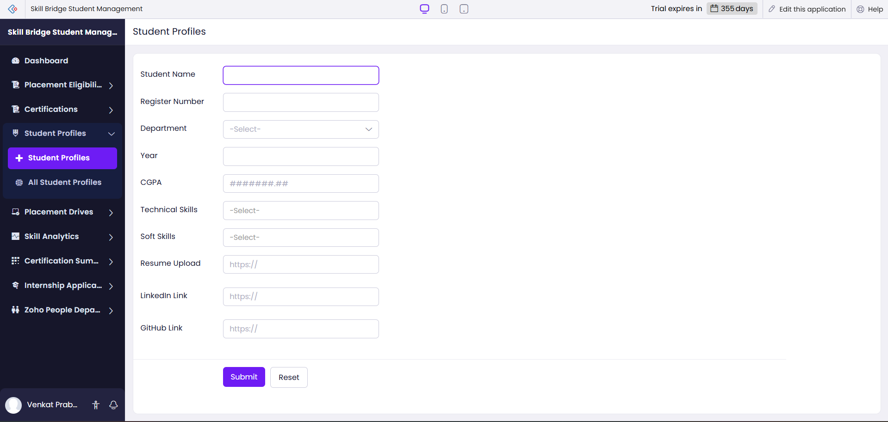
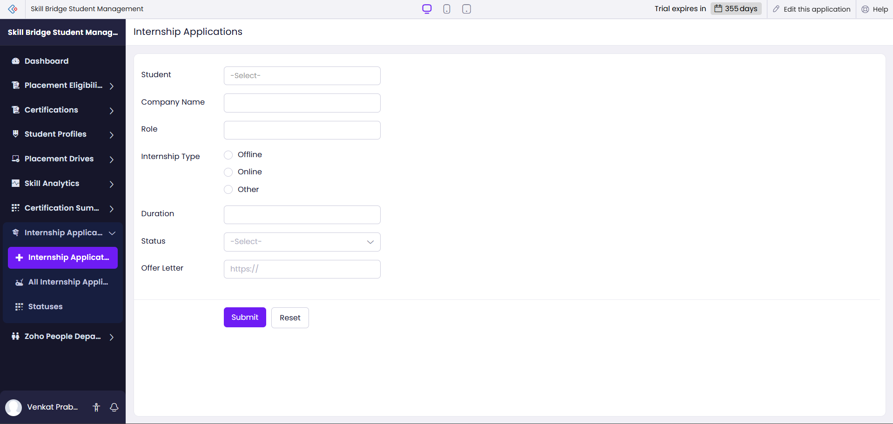
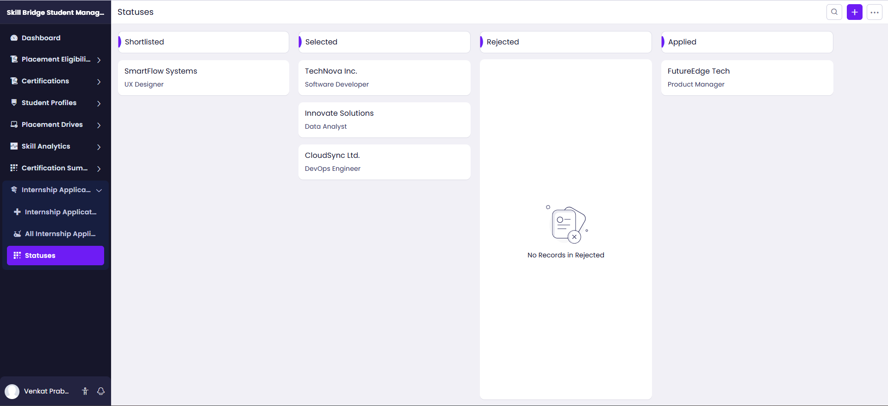
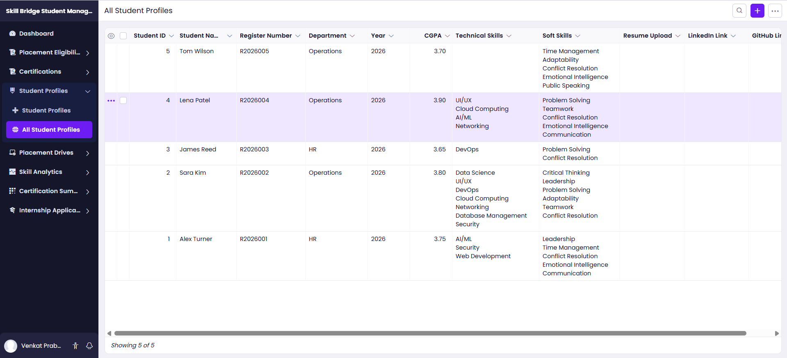

# SkillBridge – Student Skill & Internship Management System

## 📌 Project Overview
SkillBridge is a cloud-based application developed using Zoho Creator to manage student skills, certifications, internships, and placement drives efficiently within a college environment.

The system centralizes student professional development data and automates placement eligibility processes.

---

## 🎯 Objectives
- Track student technical and soft skills
- Manage certification records
- Monitor internship applications
- Automate placement drive eligibility filtering
- Provide analytics dashboard for decision-making

---

## 👥 User Roles
- Student
- Placement Coordinator
- Faculty
- Admin

---

## 🚀 Key Features
- Student Profile Management
- Certification Tracking
- Internship Status Monitoring
- Placement Drive Management
- Automated Eligibility Filtering
- Email Notifications
- Interactive Dashboards & Reports

---

## 🛠 Technologies Used
- Zoho Creator (Low-code platform)
- Deluge Scripting
- Cloud-based Database
- Role-Based Access Control

---

## 📷 Application Snapshots

### Dashboard

### Student Profile Form

### Internship Module

### Placement Drive

### Reports

---

## 🌐 Live Application Link
https://creatorapp.zoho.in/venkatprabhu2410610_ssn/skill-bridge-student-management

---

## 👨‍💻 Developed By
Venkat Prabhu
